# Examples

Practical usage examples for Context Engine MCP tools.

## Table of Contents

- [Getting Started](#getting-started)
- [Retrieval Examples](#retrieval-examples)
- [Index Management](#index-management)
- [Memory System](#memory-system)
- [Planning Workflows](#planning-workflows)
- [Code Review](#code-review)

---

## Getting Started

### First-Time Setup

Before using semantic search, index your workspace:

```json
// Tool: index_workspace
{
  "force": false,
  "background": false
}
```

**Response:**
```json
{
  "success": true,
  "message": "Workspace indexed successfully in 1234ms",
  "elapsed_ms": 1234,
  "indexed": 150,
  "skipped": 20,
  "errors": 0
}
```

---

## Retrieval Examples

### Find Authentication Code

```json
// Tool: codebase_retrieval
{
  "information_request": "How is user authentication implemented? Show me the login flow and session management."
}
```

### Search for Specific Patterns

```json
// Tool: semantic_search
{
  "query": "async function that handles HTTP POST requests",
  "file_pattern": "src/**/*.rs",
  "max_results": 5
}
```

### Get File Contents

```json
// Tool: get_file
{
  "path": "src/main.rs"
}
```

**Get specific lines:**
```json
// Tool: get_file
{
  "path": "src/service/context.rs",
  "start_line": 100,
  "end_line": 150
}
```

### Get Context for a Task

```json
// Tool: get_context_for_prompt
{
  "query": "I need to add a new MCP tool for file watching",
  "max_files": 10,
  "token_budget": 8000,
  "include_related": true
}
```

### Enhance a Simple Prompt (AI-Powered)

```json
// Tool: enhance_prompt
{
  "prompt": "Add rate limiting to the API",
  "token_budget": 8000
}
```

**Response:** Returns an AI-enhanced prompt that:
- References specific files and functions from your codebase
- Identifies existing patterns you should follow
- Suggests implementation approaches based on your code
- Highlights integration points and test patterns

### Bundle Prompt with Context (Direct Control)

```json
// Tool: bundle_prompt
{
  "prompt": "Implement user authentication",
  "token_budget": 10000,
  "format": "structured"
}
```

**Response:**
```markdown
# 📦 Bundled Prompt

## Original Prompt
Implement user authentication

## Codebase Context
*(Token budget: 10000)*

### Relevant Files
- src/auth/middleware.rs - Existing auth middleware
- src/handlers/login.rs - Login handler patterns
...
```

### Bundle with Custom System Instruction

```json
// Tool: bundle_prompt
{
  "prompt": "Fix the memory leak in the cache module",
  "format": "formatted",
  "system_instruction": "You are a senior Rust developer. Analyze the code and provide memory-safe solutions."
}
```

---

## Index Management

### Check Index Status

```json
// Tool: index_status
{}
```

**Response:**
```json
{
  "indexed_files": 150,
  "last_indexed": "2024-01-15T10:30:00Z",
  "workspace": "/path/to/project"
}
```

### Force Re-index After Major Changes

```json
// Tool: reindex_workspace
{}
```

### Background Indexing (Non-blocking)

```json
// Tool: index_workspace
{
  "background": true
}
```

### Clear Index

```json
// Tool: clear_index
{}
```

---

## Memory System

### Store Project Knowledge

```json
// Tool: add_memory
{
  "key": "api-conventions",
  "value": "All API endpoints use snake_case for JSON fields. Authentication uses Bearer tokens in the Authorization header.",
  "type": "conventions"
}
```

### Store Architecture Decisions

```json
// Tool: add_memory
{
  "key": "adr-001-rust-rewrite",
  "value": "Decided to rewrite from TypeScript to Rust for better performance and smaller binary size. See ADR-001 for details.",
  "type": "adr"
}
```

### Retrieve a Memory

```json
// Tool: retrieve-memory
{
  "key": "api-conventions"
}
```

### List All Memories

```json
// Tool: list_memories
{}
```

### List Memories by Type

```json
// Tool: list_memories
{
  "type": "adr"
}
```

### Delete a Memory

```json
// Tool: delete-memory
{
  "key": "outdated-info"
}
```

---

## Planning Workflows

### Create a Feature Plan

```json
// Tool: create_plan
{
  "title": "Add WebSocket Support",
  "description": "Implement WebSocket transport for real-time MCP communication alongside existing stdio and HTTP transports."
}
```

**Response:**
```json
{
  "id": "plan_abc123",
  "title": "Add WebSocket Support",
  "description": "...",
  "status": "draft",
  "steps": [],
  "created_at": "2024-01-15T10:30:00Z"
}
```

### Add Steps to a Plan

```json
// Tool: add_step
{
  "plan_id": "plan_abc123",
  "title": "Research WebSocket libraries",
  "description": "Evaluate tokio-tungstenite vs axum WebSocket support"
}
```

```json
// Tool: add_step
{
  "plan_id": "plan_abc123",
  "title": "Implement WebSocket handler",
  "description": "Create WebSocket transport that implements the Transport trait"
}
```

### Track Step Progress

```json
// Tool: start_step
{
  "plan_id": "plan_abc123",
  "step_id": 1
}
```

```json
// Tool: complete_step
{
  "plan_id": "plan_abc123",
  "step_id": 1,
  "output": "Selected tokio-tungstenite for WebSocket support"
}
```

### View Plan Progress

```json
// Tool: view_progress
{
  "plan_id": "plan_abc123"
}
```

**Response:**
```json
{
  "plan_id": "plan_abc123",
  "title": "Add WebSocket Support",
  "total_steps": 5,
  "completed": 2,
  "in_progress": 1,
  "failed": 0,
  "pending": 2,
  "progress_percent": 40
}
```

### Visualize Plan as Mermaid Diagram

```json
// Tool: visualize_plan
{
  "plan_id": "plan_abc123",
  "format": "mermaid"
}
```

**Response:**
```markdown
# Plan: Add WebSocket Support

```mermaid
graph TD
    S0["✅ Research WebSocket libraries"]
    S1["✅ Implement WebSocket handler"]
    S2["🔄 Add connection management"]
    S3["⬜ Write tests"]
    S4["⬜ Update documentation"]
    S0 --> S1
    S1 --> S2
    S2 --> S3
    S3 --> S4
```



### Request Approval for Critical Steps

```json
// Tool: request_approval
{
  "plan_id": "plan_abc123",
  "step_numbers": [3, 4]
}
```

### Respond to Approval Request

```json
// Tool: respond_approval
{
  "request_id": "req_xyz789",
  "action": "approve",
  "comments": "Looks good, proceed with implementation"
}
```

---

## Code Review

### Review a Diff

```json
// Tool: review_diff
{
  "diff": "--- a/src/main.rs\n+++ b/src/main.rs\n@@ -10,6 +10,7 @@\n fn main() {\n+    println!(\"Starting server...\");\n     run_server();\n }",
  "context": "Adding startup logging"
}
```

### Analyze Risk of Changes

```json
// Tool: analyze_risk
{
  "files": [
    "src/auth/handler.rs",
    "src/database/migrations/001_users.sql",
    "src/config.rs"
  ],
  "change_description": "Updating user authentication to use JWT tokens"
}
```

**Response:**
```markdown
## Risk Analysis

**Risk Level**: HIGH
**Risk Score**: 65/100

### Files Affected
- src/auth/handler.rs
- src/database/migrations/001_users.sql
- src/config.rs

### Analysis
High risk due to authentication and database migration changes...
```

### Review Git Diff

```json
// Tool: review_git_diff
{
  "base": "main",
  "head": "feature/new-api"
}
```

### Check for Secrets in Code

```json
// Tool: scrub_secrets
{
  "content": "const API_KEY = 'sk-1234567890abcdef';\nconst password = 'hunter2';"
}
```

**Response:**
```json
{
  "scanned": true,
  "findings": ["API Key", "Password"],
  "clean": false
}
```

### Run Static Analysis

```json
// Tool: run_static_analysis
{
  "files": ["src/handlers/*.rs"]
}
```

### Start a PR Review Session

```json
// Tool: reactive_review_pr
{
  "pr_number": 42,
  "base": "main",
  "head": "feature/new-feature"
}
```

**Response:**
```json
{
  "session_id": "sess_abc123",
  "status": "started",
  "started_at": "2024-01-15T10:30:00Z"
}
```

### Pause and Resume Reviews

```json
// Tool: pause_review
{
  "session_id": "sess_abc123"
}
```

```json
// Tool: resume_review
{
  "session_id": "sess_abc123"
}
```

### Get Review Metrics

```json
// Tool: get_review_telemetry
{
  "session_id": "sess_abc123"
}
```

**Response:**
```json
{
  "session_id": "sess_abc123",
  "tokens_used": 15000,
  "cache_hits": 45,
  "cache_misses": 12,
  "duration_ms": 5432
}
```

---

## MCP Client Configuration

### Claude Desktop (macOS)

Add to `~/Library/Application Support/Claude/claude_desktop_config.json`:

```json
{
  "mcpServers": {
    "context-engine": {
      "command": "/path/to/context-engine",
      "args": ["--workspace", "/path/to/your/project"]
    }
  }
}
```

### VS Code with Continue

Add to `.continue/config.json`:

```json
{
  "mcpServers": [
    {
      "name": "context-engine",
      "command": "context-engine",
      "args": ["--workspace", "${workspaceFolder}"]
    }
  ]
}
```

### HTTP Transport

For HTTP-based MCP clients:

```bash
context-engine --workspace /path/to/project --transport http --port 3000
```

Then connect to `http://localhost:3000/sse` for Server-Sent Events.

---

## Tips and Best Practices

1. **Index First**: Always run `index_workspace` before using semantic search tools.

2. **Use Memories**: Store project conventions, architecture decisions, and common patterns for consistent AI assistance.

3. **Plan Complex Tasks**: Use planning tools to break down large features into manageable steps.

4. **Review Before Commit**: Use `review_diff` and `analyze_risk` before committing significant changes.

5. **Background Indexing**: For large codebases, use `background: true` to avoid blocking.

6. **Token Budgets**: Set appropriate `token_budget` and `max_tokens` to control response sizes.

